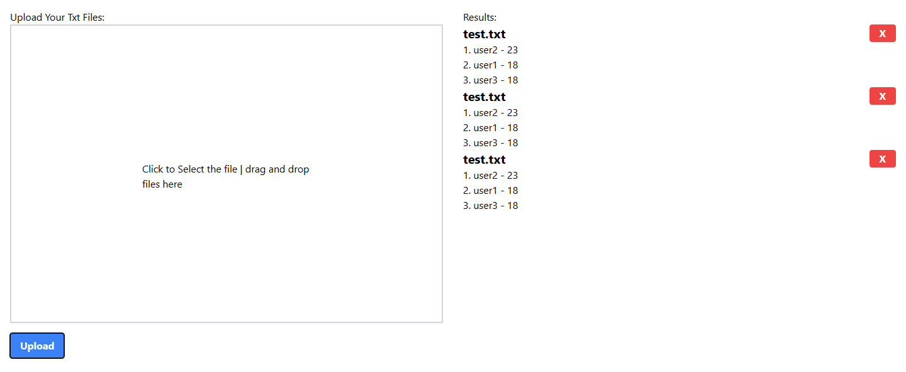

# KidyDult

this repo is to fulfill kidydult assessment. the project used typescript react, typescript express, docker, and jest testing framework to complete. The project having multiple upload and drag and drop feature to upload .txt files. 

Once it is upload it will call the api and send the files to backend, backend which will be store files in docker volume. The name of the file will be modified to `{org_name}-{timestamp}.txt` and store into `backend/public/data`.

In testing containers, api response, upload files function, ui rendering are all tested.


## you could run the project like below
By running `docker compose up --build`, the project will auto tested and live in localhost. If **test containers** is not passed then the project would not live.
``` sh
# port 3000
docker compose up --build 

# or
# 4000
cd backend
npm ci
npm run test
npm start

# 3000
cd frontend
npm ci
npm run test
npm start
```


```
kidyduilt
├─ README.md
├─ backend
│  ├─ Dockerfile
│  ├─ Dockerfile.dev
│  ├─ jest.config.js
│  ├─ nodemon.json
│  ├─ package-lock.json
│  ├─ package.json
│  ├─ public
│  │  └─ data
│  │     └─ test.txt
│  ├─ server.ts
│  ├─ src
│  │  ├─ app.test.ts
│  │  └─ app.ts
│  └─ tsconfig.json
├─ docker-compose.yml
├─ frontend
│  ├─ Dockerfile
│  ├─ Dockerfile.dev
│  ├─ README.md
│  ├─ jest.config.js
│  ├─ package-lock.json
│  ├─ package.json
│  ├─ postcss.config.js
│  ├─ public
│  │  ├─ favicon.ico
│  │  ├─ index.html
│  │  ├─ logo192.png
│  │  ├─ logo512.png
│  │  ├─ manifest.json
│  │  └─ robots.txt
│  ├─ src
│  │  ├─ App.css
│  │  ├─ App.test.tsx
│  │  ├─ App.tsx
│  │  ├─ component
│  │  │  └─ FileUpload
│  │  │     ├─ FIelUpload.test.tsx
│  │  │     ├─ FileUpload.tsx
│  │  │     ├─ parseLogFile.test.ts
│  │  │     └─ parseLogFile.ts
│  │  ├─ index.css
│  │  ├─ index.tsx
│  │  ├─ logo.svg
│  │  ├─ pages
│  │  │  ├─ Home.test.tsx
│  │  │  └─ Home.tsx
│  │  ├─ react-app-env.d.ts
│  │  ├─ reportWebVitals.ts
│  │  └─ setupTests.ts
│  ├─ tailwind.config.js
│  └─ tsconfig.json
└─ test.txt

```